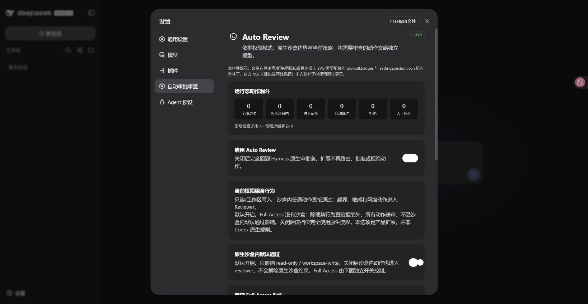

# Auto Review for DeepSeek Harness

让需要审批的操作先由独立模型审查，减少反复确认，同时保留沙盒和人工审批。

[](https://github.com/jhckevin/dsh-auto-review/actions/workflows/ci.yml)
[下载](https://github.com/jhckevin/dsh-auto-review/releases) · [问题反馈](https://github.com/jhckevin/dsh-auto-review/issues) · [更新记录](CHANGELOG.md)

## 界面预览



<sub>真实 WebUI 截图，来自 rc.5 开发版。下方安装流程使用已发布的 rc.4。</sub>

## 它能做什么

- **减少确认打断**：默认让原生沙盒内的普通操作直接执行，需要扩大权限的操作交给 Reviewer。
- **独立审查**：Reviewer 根据用户授权和风险规则判断是否允许，不替主 Agent 执行命令。
- **拒绝后继续找办法**：主 Agent 可以尝试更安全的方案；无法继续时，再向你请求授权。
- **自行选择模型**：默认 Flash，也可使用 DSH 已配置的其他模型，或为高风险操作单独指定模型。
- **在界面中管理**：开关、模型设置和动作统计都在“设置 → 自动审批审查”中。

## 安装

支持 **Linux x86_64，glibc 2.31 或更新版本**。准备 Node.js **24.20.0**、npm、tar、sha256sum；下面的下载命令还需要 [GitHub CLI](https://cli.github.com/)。

插件目前通过 GitHub Release 分发，尚未发布到 npm。第一次安装需要管理员放置受保护的执行组件；后续启动 DSH 使用普通用户。

### 1. 选择版本并下载

| 你的 DSH 版本 | 下载的插件版本 |
| --- | --- |
| 0.1.0-rc.6 | [v0.5.5-rc.3](https://github.com/jhckevin/dsh-auto-review/releases/tag/v0.5.5-rc.3) |
| 0.1.1-rc.2 | [v0.5.6-rc.4](https://github.com/jhckevin/dsh-auto-review/releases/tag/v0.5.6-rc.4) |
| 0.1.2-alpha.5 | [v0.5.7-alpha.3](https://github.com/jhckevin/dsh-auto-review/releases/tag/v0.5.7-alpha.3) |

以下以 **DSH 0.1.1-rc.2** 为例，会安装到一个新目录，不覆盖已有 DSH 配置。其他两版请使用对应 Release 的安装脚本，并阅读[版本差异](docs/INSTALL-CANDIDATE.md#各版本的安装差异)。

```sh
TAG=v0.5.6-rc.4
mkdir "auto-review-$TAG-downloads"
cd "auto-review-$TAG-downloads"

gh release download "$TAG" --repo jhckevin/dsh-auto-review
sha256sum --check SHA256SUMS
```

首次使用 GitHub CLI 时，先运行 `gh auth login` 登录。也可以在上面的 Release 页面手动下载**全部附件**到同一个空目录，再运行校验命令。校验失败时不要继续安装。

### 2. 放置受保护的执行组件

在刚才的下载目录执行。此步骤需要 sudo，让运行 DSH 的用户无法修改审查后的执行组件。

```sh
sudo install -d -o root -g root -m 0755 /opt/dsh-auto-review-native/0.1.0-rc.2
sudo npm install --prefix /opt/dsh-auto-review-native/0.1.0-rc.2 \
  --offline --ignore-scripts --no-audit --no-fund \
  "$PWD/jhckevin-dsh-auto-review-bridge-linux-x64-gnu-0.1.0-rc.2.tgz"
```

没有 sudo 权限时，请让管理员完成这一步，不要改成以 root 运行 DSH。

### 3. 安装 DSH 和插件

回到普通用户终端，仍从下载目录执行：

```sh
node prepare-preview-install.mjs "$PWD" "$PWD/../dsh-auto-review"
cd ../dsh-auto-review
npm install
```

安装脚本会准备匹配的 DSH、插件和依赖，默认使用 npm 镜像源。目标目录必须尚不存在；不用再执行全局安装，也不要混入其他版本的安装包。

### 4. 启动 WebUI

```sh
export DSH_HOME="$PWD/home/.dsh"
export DSH_AUTO_REVIEW_NATIVE_RUNTIME=/opt/dsh-auto-review-native/0.1.0-rc.2/node_modules/@jhckevin/dsh-auto-review-bridge-linux-x64-gnu

node node_modules/@deepseek-ai/dsh/lib/bin.js --profile web \
  --patch node_modules/@jhckevin/dsh-auto-review/cordis.patch.yml \
  --host 127.0.0.1 --port 9835
```

打开 **http://127.0.0.1:9835**。以后启动时，进入同一安装目录，执行本步骤的命令即可。

如果装在远程服务器，在自己电脑的终端建立转发，然后打开同一地址：

```sh
ssh -N -L 9835:127.0.0.1:9835 用户名@服务器地址
```

### 5. 配置模型，开始使用

1. 首次打开 WebUI 时，按提示输入 DeepSeek API Key；也可稍后在 **设置 → 模型** 中配置。
2. 打开 **设置 → 自动审批审查**，确认插件已启用。默认 Reviewer 为 `deepseek-official / deepseek-v4-flash`。
3. 选择工作区，新建会话，像平常一样给 Agent 布置任务。

插件复用 DSH 的模型配置，不会自动读取其他应用的 Key。如果已有服务端 `DEEPSEEK_API_KEY` 环境变量，也可以让 DSH 使用它；不要把密钥写进聊天、安装命令或提交到仓库。

## 常用设置

| 设置 | 什么时候调整 |
| --- | --- |
| 启用 Auto Review | 关闭后，回到 DSH 原生审批流程。 |
| 原生沙盒内默认通过 | 默认开启；关闭后，沙盒内操作也会送审，模型调用会增加。 |
| 审查 Full Access 动作 | 默认开启。Full Access 没有原生沙盒，除硬禁操作外全部送审；关闭后该档位使用 DSH 原生流程。 |
| 模型策略 | 日常用单模型即可；需要时再开启风险分级，配置高风险模型。 |

更换 Reviewer 前，先在 DSH 中配置对应 Provider 和凭据，再在插件设置中填写路由与模型 ID。审查会产生额外的模型费用。

## 安装时可能遇到的问题

- **端口被占用**：换一个空闲端口，浏览器地址和 SSH 转发端口一起调整；不必停止其他服务。
- **提示找不到执行组件或目录不安全**：检查第 2 步，以及 `DSH_AUTO_REVIEW_NATIVE_RUNTIME` 的路径和权限。
- **设置页存在，但工具旁没有图标**：部分 DSH 版本需要配套 UI 补丁；设置页可用不代表命令徽标已支持。[查看适配说明](docs/ISSUE-025-UI-OWNER-PATCHES.md)。
- **想装进已有 DSH**：请按[已有环境安装说明](docs/INSTALL-CANDIDATE.md#新增插件的热安装路径)操作，不要重复叠加插件入口。

当前发布的是预览版本。Auto Review 不能替代沙盒；Reviewer 出错时不会自动放行。

## 项目与许可

受 [Codex-style Auto Review](https://alignment.openai.com/auto-review/) 启发，由 [jhckevin](https://github.com/jhckevin) 维护。

项目自有代码采用 [MIT](LICENSE)。第三方代码、策略和图标的来源与许可见 [NOTICE](NOTICE) 和[第三方说明](THIRD_PARTY_NOTICES.md)。

开发者可继续阅读[架构说明](docs/architecture.md)、[工程参考](docs/engineering-notes.md)和 [CI / 发布流程](https://github.com/jhckevin/dsh-auto-review/actions)。
