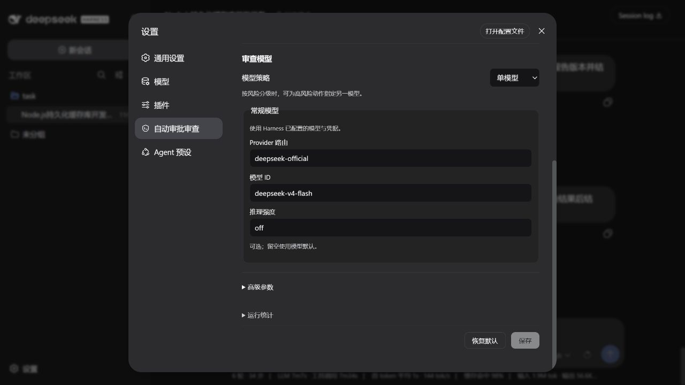
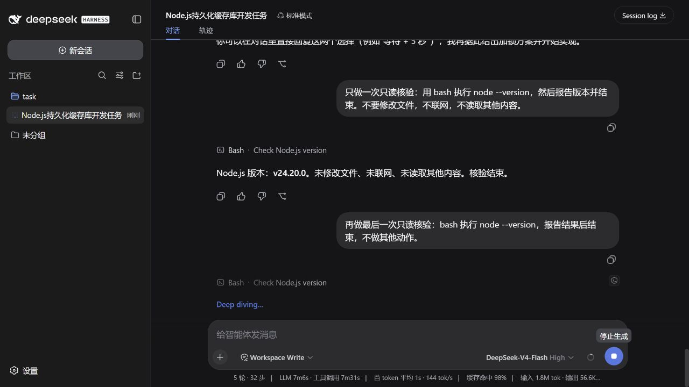

# Auto Review for DeepSeek Harness

让需要审批的操作先由独立模型审查，减少反复确认，同时保留原生沙盒和人工审批。

[安装](#安装) · [版本记录](CHANGELOG.md) · [问题反馈](https://github.com/jhckevin/dsh-auto-review/issues) · [Release](https://github.com/jhckevin/dsh-auto-review/releases)





<sub>图片来自真实 DSH WebUI，使用配套 UI 适配，不是模拟页面。</sub>

## 使用体验

- 原生沙盒内的普通动作默认免审；需要扩大权限时，由 Reviewer 判断。
- 审查中显示小盾牌，批准后移除；拒绝显示红色盾牌与斜杠。
- 被拒后可以寻找更安全的替代方案，无法继续时请求用户授权。
- 同一回合连续 3 次拒绝，或最近 50 次审查累计 10 次拒绝，会强制结束当前回合，不会删除会话。
- 默认使用 Flash，也可选择 DSH 已配置的其他模型，或按风险分级选择模型。

## 它如何工作

普通操作先遵循 DSH 的权限与沙盒设置；需要审查的操作，再交给独立的 Reviewer：

```text
操作 → 原生权限与沙盒 → 无需审查：继续执行
                     → 需要审查：Reviewer → 批准后继续
                                         → 拒绝：换安全方案，或停下来问你
```

反复被拒仍继续尝试时，熔断会结束当前回合。它不是自动放行，也不会因为审查出错而跳过安全检查。

**请留意额外的 token 费用。** 每次审查都需要发送操作、相关上下文与策略。以此前反馈的小样本为例，约 8 次较高频审查可能累计数万输入 token，输入缓存命中约 50%；这不是固定开销或命中率保证，实际取决于模型、上下文和请求前缀是否重复。缓存命中的输入通常也并非免费，请以 Provider 的用量与价格为准。

## 安装

支持 **Linux x86_64 / glibc 2.31+**，建议 Node.js **24.20.0**。

一个 npm 包共用后端，安装时只下载当前宿主需要的界面适配。自动匹配 **DSH 0.1.0-rc.6、0.1.1-rc.2、0.1.2-alpha.5**，不用选择插件的 rc6 / rc2 / alpha5 通道。不识别的宿主版本会明确报错，不会强行安装旧适配。

> 此分支为 0.6.1 发布准备。npm 发布完成前，请从本分支 Actions 取得候选 tgz，通过 `dsh plugin --profile web add ./候选包.tgz` 安装。
> DSH 的 `latest` 目前已到 0.1.2-rc.1，尚不在上述兼容范围。新环境请先安装下面的固定宿主版本。

### 1. 安装 DSH 和插件

已有兼容版本的 DSH 时，跳过第一条：

```sh
npm install -g @deepseek-ai/dsh@0.1.1-rc.2
dsh plugin --profile web add @jhckevin/dsh-auto-review
```

### 2. 初始化执行组件

每台机器首次安装时由管理员执行一次。执行组件与普通用户的插件目录分离，避免 Agent 修改它。

```sh
sudo npm install --prefix /opt/dsh-auto-review-native/0.1.0-rc.2 \
  --ignore-scripts --no-audit --no-fund \
  @jhckevin/dsh-auto-review-bridge-linux-x64-gnu@0.1.0-rc.2

export DSH_AUTO_REVIEW_NATIVE_RUNTIME=/opt/dsh-auto-review-native/0.1.0-rc.2/node_modules/@jhckevin/dsh-auto-review-bridge-linux-x64-gnu
```

在启动 DSH 的终端或服务配置中保留这个环境变量。不要用 root 运行整个 DSH。

### 3. 安装界面图标

停止 DSH 后运行；会自动识别宿主版本，只下载对应适配，校验内容并保留原文件备份：

```sh
npx --yes --package=@jhckevin/dsh-auto-review dsh-auto-review-ui
dsh --profile web
```

无法直连 GitHub 时，可在安装界面图标前设置 `export DSH_AUTO_REVIEW_DOWNLOAD_MIRROR=https://ghfast.top/`；仍会核对固定内容哈希。

若没有找到宿主，增加 `--dsh-root /实际的/node_modules`。需要还原时运行同一安装器并加 `--restore`。界面适配需要重启 DSH；它不修改工具执行、权限或沙盒代码。[详细说明](docs/UI-INSTALL.md)

同名插件升级由 DSH/npm 替换当前 profile 中的旧包，不会并排启用三个版本。原生 bridge 的 host/platform 包是必需依赖，不是多余版本；不会清理会话、配置、密钥或其他 profile。

### 4. 配置模型

先在 **设置 → 模型** 中配置 Provider 与 API Key，再打开 **设置 → 自动审批审查**，启用插件并选择 Reviewer。

插件使用 DSH 配置的凭据，不会读取其他应用的密钥。审查会产生额外的模型费用。

## 常用设置

| 设置 | 说明 |
| --- | --- |
| 启用 Auto Review | 关闭后完全回到 DSH 原生审批流程。 |
| 原生沙盒内默认通过 | 默认开启；关闭后沙盒内动作也会送审。 |
| 审查 Full Access 动作 | 默认开启；Full Access 没有沙盒，除硬禁动作外全量送审。关闭后该档位使用原生流程。 |
| 模型策略 | 单模型用于日常审查；风险分级可为高风险动作指定另一模型。 |

Auto Review 不能替代沙盒。Reviewer 故障不会自动放行，也不能保证模型永远判断正确。

## 项目与许可

受 [Codex-style Auto Review](https://alignment.openai.com/auto-review/) 启发，由 [jhckevin](https://github.com/jhckevin) 维护。

项目自有代码采用 [MIT](LICENSE)。第三方代码、策略和图标的来源见 [NOTICE](NOTICE) 和[第三方说明](THIRD_PARTY_NOTICES.md)。架构、验证记录及限制放在 [docs](docs/)，不混入快速安装步骤。
